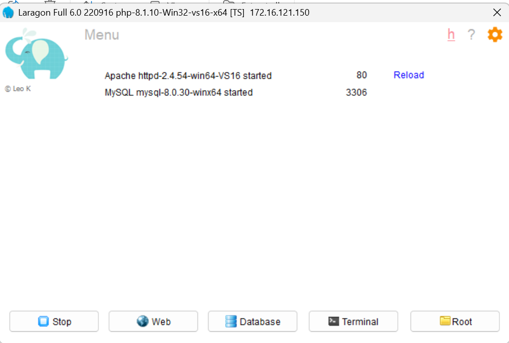
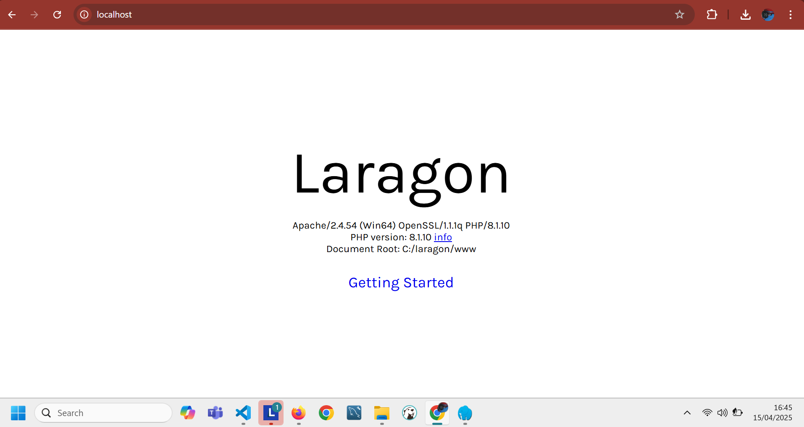
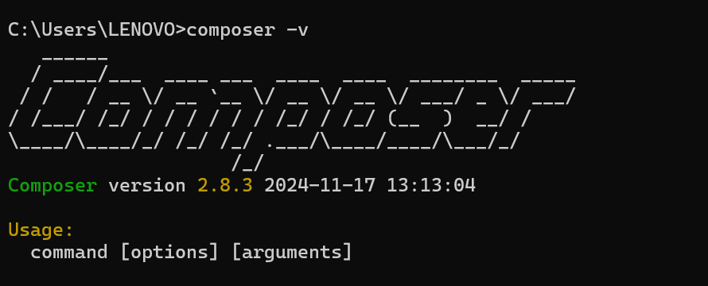
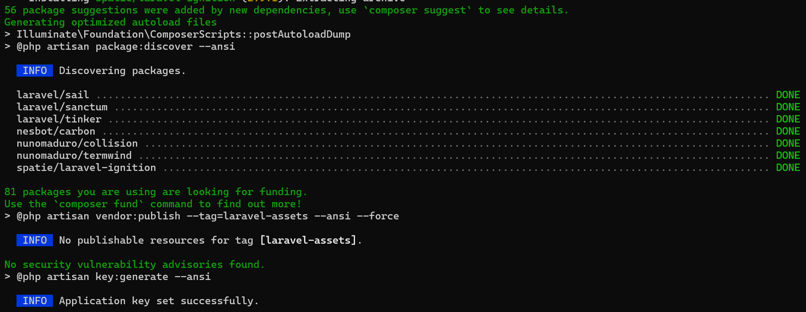
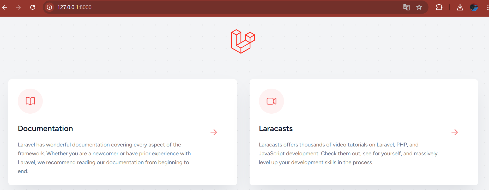
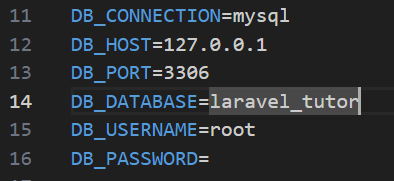

# 🚀 Panduan Instalasi laragon, Composer, dan Laravel 11 (Windows)

Dokumen ini menjelaskan langkah-langkah untuk menginstal LARAGON, Composer, dan Laravel 11 pada sistem operasi **Windows**, lengkap dengan gambar pendukung. Seluruh gambar disimpan di dalam folder [`images/`](./images/) dalam struktur repository GitHub.

---

# 🔧 Instalasi Laragon

## Langkah-langkah:

1. **Unduh Laragon** dari situs resminya:  
   ➡️ [https://laragon.org/download/](https://laragon.org/download/)

2. **Jalankan installer** Laragon dan ikuti proses instalasi sampai selesai.

3. Setelah selesai, buka **Laragon** dan klik tombol:
   - `Start All` untuk menjalankan semua layanan (Apache/Nginx dan MySQL).

4. Jika berhasil, kamu akan melihat tampilan seperti berikut:

   

5. Buka browser dan akses alamat berikut:
   ```
   http://localhost/
   ```


6. Jika muncul tampilan default Laragon, artinya semua service berjalan dengan baik:




---

## 2. 💡 Instalasi Composer

### Langkah-langkah:

## 2. 💡 Instalasi Composer (Versi Laragon)

### Langkah-langkah:

1. Composer sudah **terinstal otomatis** di Laragon (tidak perlu instal manual ✅).

2. Untuk memverifikasi instalasi Composer, buka **Command Prompt** atau **Terminal Laragon**, lalu ketik:

   ```bash
   composer -V
   ```

   

---

## 3. ⚙️ Instalasi Laravel 11

### Langkah-langkah:

1. Buka terminal (CMD, PowerShell, atau Git Bash).

2. Jalankan perintah untuk membuat proyek Laravel 11:

   ```bash
   composer create-project laravel/laravel:^11.0 nama-proyekmu
   ```

   Contoh:

   ```bash
   composer create-project laravel/laravel:^11.0 laravel_tutor
   ```

   

3. Masuk ke folder proyek:

   ```bash
   cd laravel_tutor
   ```

4. Jalankan server Laravel:

   ```bash
   php artisan serve
   ```

5. Akses Laravel di browser:

   ```
   http://127.0.0.1:8000
   ```

   

---

## 4. ⚠️ Konfigurasi Database

1. Buka `http://localhost/phpmyadmin` untuk membuat database baru.
2. Buka file `.env` di folder Laravel dan sesuaikan:

   ```dotenv
   DB_CONNECTION=mysql
   DB_HOST=127.0.0.1
   DB_PORT=8111
   DB_DATABASE=laravel-app
   DB_USERNAME=root
   DB_PASSWORD=
   ```

   

---

## 📚 Referensi

- Laravel 11 Docs: https://laravel.com/docs/11.x
- Composer: https://getcomposer.org
- Laragon: https://laragon.org

---

📅 **Selesai!**

